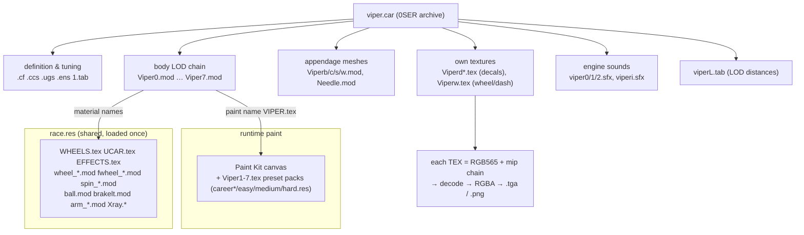

# Viper Racing (1998) — Car Asset Decomposition Tree

**Purpose:** a top-down map of *what is inside a car* and *where every piece it needs actually comes from* —
the containment tree (`.car` → members → textures → pixels) plus the shared `.res` bundles a car reaches
into at runtime. This is the companion to [VIPER_RACING_FILE_FORMATS.md](VIPER_RACING_FILE_FORMATS.md)
(which documents the byte layout of each format); this document is about **structure and resolution**, not
byte offsets. Everything below was walked directly out of a pristine retail `Data/` folder with `vrmod`.

**Confidence key** (same as the format reference): ✅ CONFIRMED · 🟡 WELL-SUPPORTED · ⚪ HYPOTHESIS.

---

## 1. The mental model: two containers and name-based resolution

Everything ships in one of two **0SER package archives** (see the format reference, §3):

- **`<name>.car`** — one car. Self-describing: physics, the body meshes, its own textures, sounds, spec card.
- **`*.res`** — shared bundles loaded once and used by *every* car and the race itself (wheels, the driver's
  arms, HUD, sounds, effect textures, paint presets, the Paint Kit).

The single most important rule for modders: ✅ **a mesh does not embed its textures — it names them.** Each
material inside a `.mod` carries a texture *name* (e.g. `VIPER.tex`, `WHEELS.tex`). At load time the engine
resolves that name **case-insensitively**, in this order:

```
material "FOO.tex"  ─►  1. a TEX member named FOO.tex inside the SAME .car   (self-contained)
                        2. a shared TEX member in the loaded .res bundles     (WHEELS/UCAR/EFFECTS/…)
                        3. the runtime paint slot supplied by the Paint Kit   (the car's paint, if unshipped)
```

That one rule explains almost every "why did my car turn into a viper / lose its texture" puzzle: it's a
name that resolved to the wrong tier.



---

## 2. Anatomy of a car — `viper.car`, fully decomposed

The viper is the **runtime-paint** case (its paint is *not* in the archive — see §4). 30 members:

```
viper.car ................................. 0SER package archive (one car)
│
├── DEFINITION / TUNING
│   ├── viper.cf ......... [CARF] physics & dimensions (masses, grip, geometry — floats)        ✅ format / 🟡 fields
│   ├── viper.ccs ........ [CCS0] colour-scheme descriptor (RGB float triplets, 140 B)          🟡
│   ├── viper.ugs ........ [UPGS] upgrade catalog (StockSetup, AirInduction, Headers, Tires…)   🟡
│   ├── viper1.tab ....... [STAB] showroom spec card ("Dodge Viper", 0-60, ¼-mile, top speed…)  ✅
│   └── viperL.tab ....... [STAB] LOD distance table — the switch thresholds (see §4.3 of formats) ✅
│
├── BODY — the 8-level LOD chain (swapped by camera distance)
│   ├── Viper0.mod ....... [MINF] 325 v / 389 f   materials → VIPER.tex, UCAR.tex, WHEELS.tex, EFFECTS.tex
│   ├── Viper1.mod ....... [MINF]                  (materials thin out as detail drops)
│   ├── … Viper6.mod
│   └── Viper7.mod ....... [MINF]  26 v / 16 f     materials → viper.tex, ucar.tex
│         └── material (32-byte record): NAME + vertex/face ranges  ──►  resolves per §1
│
├── APPENDAGE MESHES (per-car, keyed off the filename prefix)
│   ├── Viperb.mod ....... [MINF] brake lights   (sits at −Z → rear)                            ✅
│   ├── Vipers.mod ....... [MINF] spoiler        (−Z → rear; nose is +Z)                        ✅
│   ├── Viperc.mod ....... [MINF] cockpit interior shell                                        🟡
│   ├── Viperw.mod ....... [MINF] steering wheel (cockpit view only)                            ✅
│   └── Needle.mod ....... [MINF] gauge needle — FIXED name (not prefixed), ships in the car    ✅
│
├── OWN TEXTURES  (TEX = RGB565 + mip chain; see §7)
│   ├── viperd.tex ....... [TEX ] 256² decal sheet (alpha)                                      ✅
│   ├── Viperd1.tex … Viperd4.tex ... decal variants                                            ✅
│   └── Viperw.tex ....... [TEX ] 512² steering-wheel / dash texture                            ✅
│         (note: the PAINT — "VIPER.tex" named by the body — is NOT here; see §4)
│
├── SOUND
│   ├── viper0.sfx / viper1.sfx / viper2.sfx ... [SFX0] engine samples (load/RPM layers)        🟡
│   ├── viperi.sfx ....... [SFX0] idle loop                                                     🟡
│   └── vipere.ens ....... [ESFX] engine sound envelope (pitch/RPM curve, floats)               🟡
│
└── SHARED-NAME TABLE
    └── cockpit.tab ...... [STAB] cockpit HUD layout — FIXED name, ships in the car             ✅
```

> **Suffix convention** (✅): the engine derives every internal member name from the `.car` *filename*.
> `<prefix>0..7` = body LODs, `b` = brake, `c` = cockpit, `s` = spoiler, `w` = steering wheel,
> `d/d1..d4` = decals, `L.tab` = LOD table, `1.tab` = spec card. This is why a naive rename of `viper.car`
> to `jeep.car` crashes (`Couldn't load ModelInfo jeep0.mod`) — and why the toolkit's `carfork` exists.

---

## 3. The other kind of car — `exotic.car` (self-contained paint)

Same skeleton, one crucial difference: the paint **ships inside the archive**, so the body's paint material
resolves at tier 1 instead of the runtime slot.

```
exotic.car
├── exotic.cf / exotic.ccs / exotic.ugs / exotic1.tab / exoticL.tab   (definition/tuning — as above)
├── Exotic0.mod … Exotic7.mod   body LODs
│     └── Exotic0.mod materials → Exotic.tex, UCAR.tex, EFFECTS.tex
├── Exoticb/c/s/w.mod, Needle.mod   appendages
├── Exotic.tex ........ [TEX ] ◄── THE PAINT, shipped in the car (174 KB)   ✅ self-contained
└── …sounds, cockpit.tab
```

---

## 4. Paint: self-contained vs. runtime (the sports-car question)

The five stock cars split into two camps — verified by listing the `TEX` members of each `.car`:

| Car | Body names its paint as | Paint texture shipped in the `.car`? | Where the pixels come from |
|-----|------------------------|--------------------------------------|----------------------------|
| **exotic** | `Exotic.tex` | ✅ yes (`Exotic.tex`, 174 KB) | the archive itself |
| **plane**  | `plane.tex`  | ✅ yes (`plane.tex`)          | the archive itself |
| **sedan**  | `Sedan.tex`  | ✅ yes (`Sedan.tex`)          | the archive itself |
| **viper**  | `VIPER.tex`  | ❌ **no**                     | **runtime (Paint Kit)** + `Viper1-7.tex` preset packs |
| **sports** | `Sports.tex` | ❌ **no** (ships *zero* `.tex`) | **runtime (Paint Kit)** |

So the "does sports have its own texture?" answer is *both*: **in-game** it clearly has a paint (the yellow/red
you see in the showroom's Paint Kit), but **on disk** `sports.car` contains no texture at all — the paint is
supplied at runtime. `viper.tex`/`sports.tex` appear **only as material name references**, never as stored
pixels.

What actually feeds the runtime paint for these two:

- **`<prefix>.ccs`** [CCS0] — a small block of RGB float triplets: the car's colour scheme (base + trim). 🟡
- **`Viper1.tex` … `Viper7.tex`** — seven numbered viper liveries, shipped (identically) in **every**
  `career1-4.res` and `easy/medium/hard.res`. ✅ These are the field/opponent paint schemes.
- **The Paint Kit** (showroom → *Paint Kit*) — the live editor. `Template` dumps the blank UV layout,
  `Export` writes the current paint to a file, `Import` loads one back, `Default` resets. This is the real
  edit path for the runtime-paint cars, and the bridge to an actual `.tex`/image file.

> **Toolkit implication:** `vrmod` edits paint in-place for exotic/plane/sedan (the `.tex` is right there in
> the `.car`). For viper/sports the paint lives outside the car, so the workflow is Paint Kit **Export → edit
> → Import**, or hand `vrmod` an exported texture. `carfork` already respects this: forking an exotic renames
> `Exotic.tex → newname.tex`; forking a viper leaves the runtime paint slot alone (nothing to rename).

---

## 5. Shared containers — the `.res` bundles

### `race.res` — the shared runtime kit (57 members) ✅

Loaded once for a race; every car draws from it. This is where the "missing" parts of a car actually live:

```
race.res
├── WHEELS & TIRES (shared, LOD'd — NOT per-car)
│   ├── wheel_1/2/3.mod ....... rear wheel, 3 LOD levels
│   ├── fwheel_1/2/3.mod ...... front wheel, 3 LOD levels
│   ├── spin_l.mod / spin_r.mod  spinning-blur wheels (left/right)
│   ├── diskglow.mod .......... brake-disc glow
│   └── wheels.tex ............ shared wheel texture
├── DRIVER
│   └── arm_ll/lr/sl/sr/ul/ur.mod   driver arm poses (l/r × pose)                               ⚪
├── SHARED MESHES / EFFECTS
│   ├── ball.mod .............. the hornball  🐍
│   ├── brakelt.mod .......... shared fallback brake light
│   └── Xray.mod + Xray.tex ... the F3 x-ray chassis view
├── SHARED TEXTURES (named by car materials)
│   ├── ucar.tex ............. undercarriage / chassis
│   ├── effects.tex / effectsx.tex   glass, lights, misc effects
│   ├── damage.tex ........... damage overlay
│   └── skid.tex / splash.tex  skid marks / water splash
├── SHARED SOUNDS
│   ├── horn.sfx, shift1.sfx, squeal.sfx, scrape.sfx
│   ├── crash1/2/3.sfx, splash.sfx
│   ├── road1/2.sfx, cboth/cclear/cleft/cright.sfx (collision), go/ready.sfx
└── HUD / FONTS (STMP sprites)
    └── mph.stp, rpm.stp, start.stp, status.stp, r_euro6/7/9/19.fnt, r_lcd.fnt …
```

### Paint-preset packs — `career1-4.res`, `easy/medium/hard.res` ✅

Each is the **same** seven-member set: `Viper1.tex … Viper7.tex` — the numbered viper liveries used to paint
the field, one bundle per career slot / difficulty.

### The rest

| `.res` | Holds | Tags |
|--------|-------|------|
| **paintkit.res** | Paint Kit editor assets — brushes, cursors, colour bar, `decals.tab` (❗not the paints) | STMP, CANV, STAB |
| **common.res** | shared UI chrome — buttons, fonts, click sfx, one `TIRE`/`CCS0`/`TEX` | STMP + misc |
| **ui.res** | front-end screens — boards, calendar, catalog, chooser, `SEAS` season data | STMP, SEAS, TEX |
| **postrace.res** | results/telemetry screens — gears, graph, shocks, balance panels | STMP, CANV |
| **drivers.res** | **empty** in retail (0 members; `.bak` present) | — |

---

## 6. Member-type glossary (0SER tag → file → meaning)

| Tag | Ext | Meaning | Confidence |
|-----|-----|---------|-----------|
| `MINF` | `.mod` | Model Info — a mesh: vertices, faces, materials (each names a texture) | ✅ |
| `TEX ` | `.tex` | Texture — RGB565 pixels + mip chain (§7) | ✅ |
| `STAB` | `.tab` | Table — cockpit layout, LOD distances, spec card | ✅ |
| `CARF` | `.cf`  | Car definition — physics & dimensions | ✅ struct / 🟡 fields |
| `CCS0` | `.ccs` | Colour scheme — RGB float triplets | 🟡 |
| `UPGS` | `.ugs` | Upgrade / tuning catalog | 🟡 |
| `ESFX` | `.ens` | Engine sound envelope (pitch/RPM curve) | 🟡 |
| `SFX0` | `.sfx` | Sound sample | ✅ |
| `STMP` | `.stp`/`.fnt` | Bitmap sprite / bitmap font ("stamp") | ✅ |
| `CANV` | `.cvs` | Paint Kit canvas / brush | 🟡 |
| `TIRE` | — | Tire physics record (common.res) | ⚪ |
| `SEAS` | — | Season / calendar data (ui.res) | ⚪ |

---

## 7. The leaf: `.tex` → pixels → image file

The bottom of the tree — the `.tex` → `.tga` step in the classic mental sketch — is a real, reversible
pipeline (✅, implemented in `vrmod/tex.py`):

```
<name>.tex  [TEX ]
   ├── header: flags (alpha / colour-key bit), wrap mode, colour-key value, mip_count
   └── pixel data: a mip CHAIN, smallest → largest, each pixel 16-bit RGB565
                    (base level size = 2^(mip_count-1), square, power-of-two)
        │
        ├─ decode base level ─► RGBA bytes ─► write .tga  (vrmod: tex_to_tga)
        │                                    ─► write .png  (vrmod: tex_to_png_bytes)
        └─ re-encode .tga/.png back to .tex (RGB565 + rebuilt mips)  (vrmod: tga_to_tex)
```

Colour-key note (✅): a texture flagged colour-key treats one exact RGB565 value as transparent — which is
why hand-authored textures must avoid that value in opaque areas (the `R5=0, B5=0` gotcha documented in the
OBJ+texture pipeline).

---

*Walked from a pristine retail `Data/` with `vrmod`; member lists and texture references are byte-exact,
semantic labels carry the confidence tag shown. Companion to the
[file-format reference](VIPER_RACING_FILE_FORMATS.md). 🐍*
